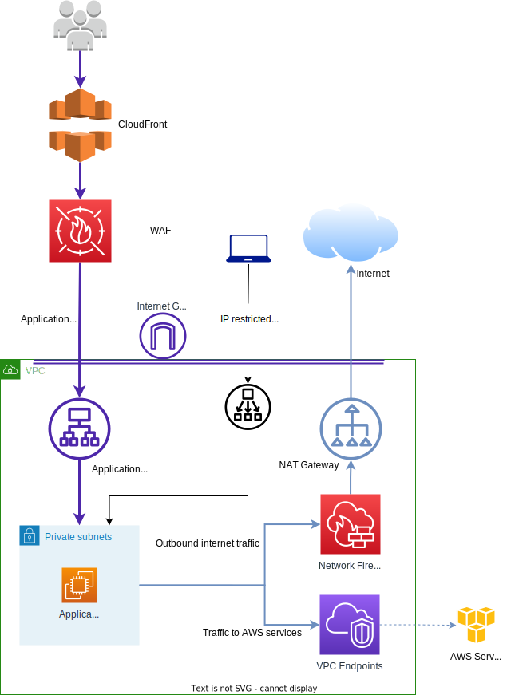

# Network/VPC

Infrastructure is created inside a VPC for each environment. Generally:

* Everything is created in private subnets except for public Load Balancers
* Intra-VPC traffic is unencrypted - we'd like to change this longer term, but it would require more application changes than we're comfortable making before migrating
* Security Group ingress rules are used for filtering intra-VPC network traffic
  * Network ACLs and Security Group egress rules are also configured, but are less strict to avoid duplicating configuration

See the networking Terraform module for details.

TODO: DT-39 enable GuardDuty monitoring of VPC flow logs

## ACL

We primarily use one, reasonably permissive, ACL which allows the following traffic:

* All intra-VPC/peered VPC traffic
* Port 443 ingress for HTTPS
* Port 80 ingress for HTTP
  * TODO: Remove this
* Port 22 from specific IP addresses
* All egress
* Ingress on ephemeral ports and ICMP

## Security groups

Security groups are defined for each service and we will not list them all here.

The following security groups allow open ingress from the internet:

* Public Application Load Balancers that accept incoming HTTPS traffic
* Default security group for AWS DS
  * TODO DT-146 fix this

## Ingress points for deployments and maintenance

Several of the instances are SSM enabled and AWS Systems Manager Session Manager can be used to access them.

TODO: Make sure logging and KMS is set up for session manager in eu-west-1

Excluding application traffic the only other network ingress point is an IP-restricted SSH bastion.
This is primarily used for development access in the test and staging accounts, but also acts as a backup method for accessing production.
Developer's SSH public keys are uploaded to an S3 bucket, and the bastion host automatically fetches these and sets up a user per-key.

TODO: Ship SSH logs to CloudWatch from the bastion host.

There is also a GitHub runner instance in each environment attached to the delta-marklogic-deploy repository.

## Egress

### AWS Services

VPC endpoints are used for access to AWS services.
Some of these have policies which apply additional restrictions, but most do not.
See the Terraform code for details.

### Network Firewall

Outbound internet connections from private subnets go via AWS Network Firewall, and then an AWS NAT Gateway.

Network Firewall performs per-subnet allowlist filtering based on SNI and Host header for TLS and HTTP traffic respectively.
Other outbound traffic is dropped with the exception of outbound SSH for the GitHub runner.

See the [networking module](../../terraform/modules/networking/main.tf) for the full allowlist.

TODO: Monitoring for Network Firewall

TODO: Remove permissive rules for Delta Website

